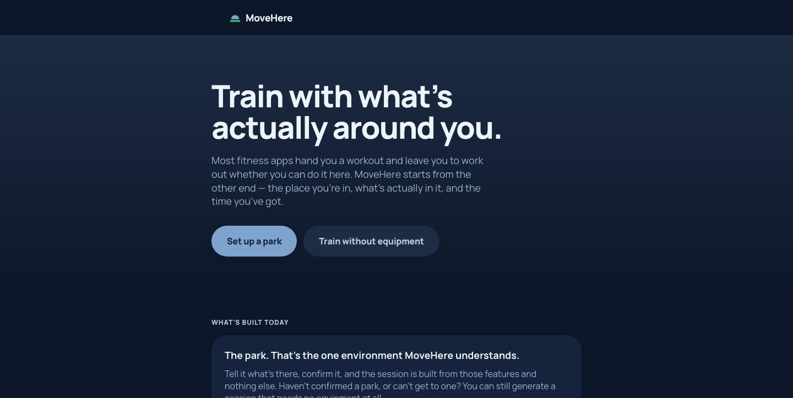
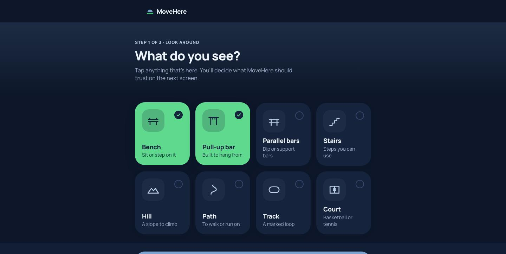
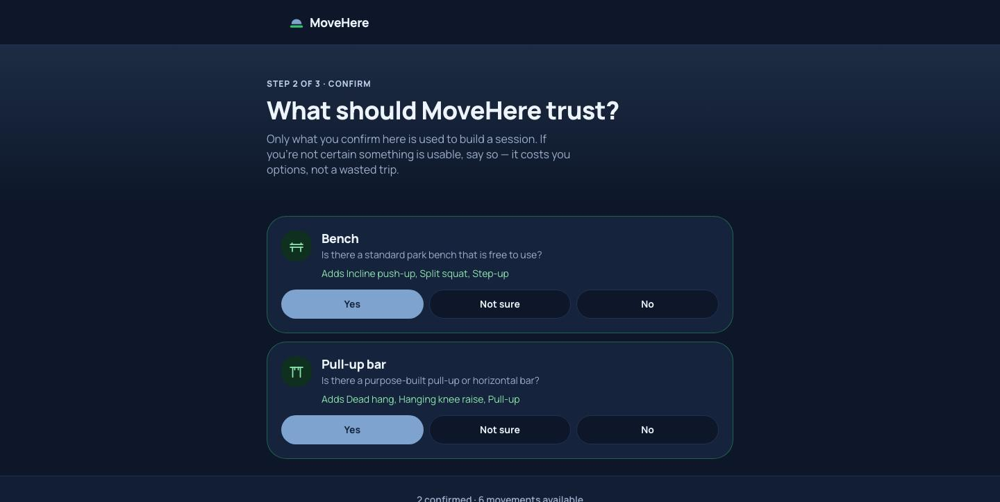
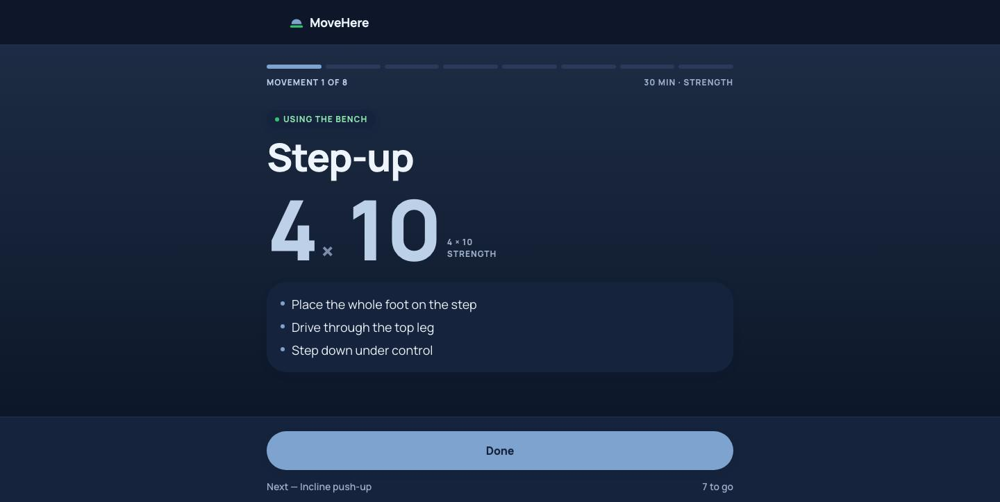
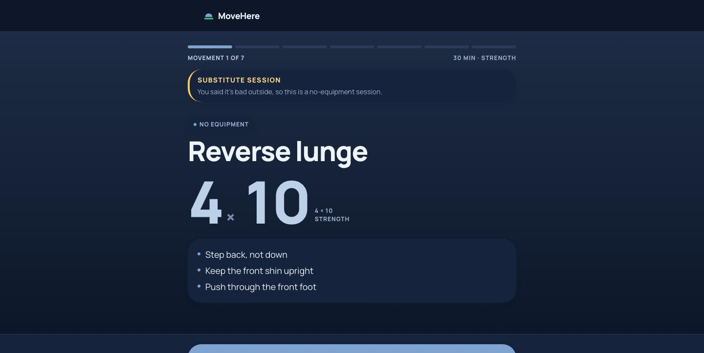

# MoveHere

Build a workout from the place you're in, what's actually there, and the time you have.

Most fitness products start with a workout and leave you to work out whether you can do it here. MoveHere starts from the other end: you tell it what a nearby park has, you confirm it, and it generates a session that uses only those features — or a no-equipment session when the park isn't an option.

**[Try it →](https://amina-moufakkir.github.io/MoveHere/)** · no signup, nothing leaves your device

*MoveHere is a working name. Availability and trademark clearance are not complete.*

## What it looks like

|  |  |
|---|---|
|  |  |
| **The pitch.** Environment first, park named as the one thing built. | **Step 1 — look around.** Tap what you can actually see. Nothing is trusted yet. |
|  |  |
| **Step 2 — confirm.** Only what you confirm reaches the generator, and each feature shows what it unlocks. | **A park session.** Every movement cites the confirmed feature it came from. |



**A substitute session.** When the park is unavailable, you still get a workout — labelled a substitute, with the reason it withheld the park, and never presented as a park session.

## Status

**Phase 0 — Product & Engineering Foundation.** Phase 0 is not the MVP and not a launch candidate.

The mechanism is built and runs end to end: the confirmation contract, the compatibility matrix, the goal programming policies, deterministic generation, and a working six-route application over the top. What is *not* established is that anyone wants it. The problem, the target user, the competitive differentiation, and the venue-aware value proposition remain **unvalidated hypotheses** (§17).

Sessions are generated from **project-authored training content, not programming reviewed by a qualified fitness professional**. The app says so on every screen that shows a session. Obtaining that review is the single external dependency on the Phase 0 critical path.

The absence of research is never evidence that the hypotheses hold.

## Positioning

Three things the plan deliberately keeps apart (§4), because collapsing them is how "park-first" quietly becomes "park-only":

| | |
|---|---|
| **Product direction** | A session built around the environment you're in, the resources available to you, the time you have, and the goal you choose. |
| **Implemented today** | Park-aware sessions from user-confirmed park features, plus environment-independent sessions needing no equipment. Nothing else. |
| **Differentiating proof** | The park is the first environment-aware implementation and the evidence the mechanism works: confirmed features materially change the generated session (Gate I). |

Environment awareness is the capability; the park is the first instance of it. No-equipment generation is **not** the differentiator — it overlaps what existing products already do, and its role here is continuity when the park is unavailable.

## The three states that must never collapse

```text
Object detected  ≠  Object supported for exercise  ≠  Object verified structurally safe
```

MoveHere makes the first two claims. It never makes the third, and no copy in the product implies it. This is enforced in the type system, not only in review.

## How it works

```text
Select what you can see   →   candidates (not venue state)
        ↓
Confirm it                →   confirmed venue inventory
        ↓
Time + goal + conditions  →   generation input
        ↓
Deterministic generation  →   park session, or a labelled substitute
        ↓
Complete, then correct    →   corrections change the next session, never the last one
```

Manual selection is currently the only candidate source. Vision is out of scope for Phase 0, and when it arrives it enters at the same `candidate → confirmation → confirmed inventory` seam rather than getting a second route into generation.

## Stack

- **Next.js 16** (App Router, Turbopack) · **React 19** · **TypeScript 5.9** · **Tailwind CSS 4**
- No database, no authentication, no server-side persistence. Phase 0 state is local only, in `localStorage`.
- No runtime dependencies beyond Next and React. The test harness is Node's built-in test runner plus `tsc` — no test framework.
- Requires **Node 22.6+** — the runtime tests run TypeScript directly via `--experimental-strip-types`. Developed on Node 22.23.

## Local setup

```bash
npm install
npm run dev          # http://localhost:3000
```

To look at the production build the way it actually ships:

```bash
npm run build        # static export to out/
npm run preview
```

## Verification

```bash
npm run verify       # everything below, in order
```

| Command | What it checks |
|---|---|
| `npm run typecheck` | `tsc --noEmit` |
| `npm run test:contracts` | 30 negative contract tests — each asserts something the domain must make *impossible* |
| `npm run test:runtime` | 91 runtime tests across 7 files |
| `npm run check:feasibility` | every goal × duration is satisfiable from the shipped matrix |

The contract suite is inverted: each file declares the TypeScript error it expects, and the suite passes only when every file *fails* to compile with that error. A negative test that starts compiling is a regression — an invariant stopped being enforced.

## Deployment

Static export to GitHub Pages, built and published by [`.github/workflows/deploy.yml`](.github/workflows/deploy.yml) on every push to `main`. The workflow verifies before it builds, so a deploy cannot ship content the contract suite rejects.

There is no server, and that is not a limitation being worked around: every route prerenders, all state is local, generation is a pure function, and nothing reads a request. The deployed page also makes no third-party requests — the font is self-hosted at build time.

## Engineering highlights

- **Branded domain types.** `ConfirmedVenueInventory`, `ConfirmedFeatureSet`, `GenerationVenueView`, `SessionMinutes` and friends can only be produced by their owning constructor. Brands protect collections as well as containers, because the natural way to "update" an inventory is to spread it — and an array spread loses the witness. What they can't stop is a deliberate assertion, so that stays a review obligation.
- **A single rehydration boundary.** `JSON.parse` returns `any`, which assigns to anything and would silently defeat the confirmation guarantee across a reload. It is confined to one function per store, and reads fail closed: unreadable state is *no* state, never half-restored state.
- **Deterministic generation.** Same inputs and seed, same session — which is what makes Gate I and Gate J comparisons meaningful. Sessions are never stored; only the seed and the request behind them are, so a reload regenerates rather than replaying a stale artifact.
- **A completed session is a record, not a derivation.** Completion snapshots what was done, so correcting a feature afterwards changes the next session without rewriting the one you just finished.
- **Programming is data, not code.** The generator holds no exercise knowledge; you can read it end to end without learning anything about training. Policies are validated against the compatibility matrix before they can be used, so an unsatisfiable policy is caught at load rather than as a user getting no workout.
- **Three authority tiers.** `reviewed` / `project-content` / `test-fixture`. Test authority cannot carry review provenance, draft policy cannot reach generation, and project content is presentable but labelled.
- **Adverse and unknown stay distinct.** "Conditions are bad" and "we couldn't tell" both withhold the park, but remain separate in provenance, because collapsing them would corrupt the seasonality signal.

## Current limitations

Honest list, not a roadmap:

- **Training content is not professionally reviewed.** Project-content tier. Gate E and Gate I are unevaluable until at least one reviewed goal policy exists.
- **Parks only.** Eight supported features, nine explicitly excluded objects, 22 exercises. Home, gym and indoor venues are not built.
- **Two goals.** Strength and conditioning. Mobility is deferred pending domain review; it exists as a movement pattern, not as a goal you can request.
- **No vision.** Manual selection only.
- **Conditions are user-reported.** No weather service.
- **One venue.** A single local "home park", no venue discovery, no accounts, no sync. Clearing site data clears everything.
- **Accessibility is a Phase 0 constraint, not yet a Phase 1 implementation.** Semantic structure, keyboard access and visible focus are in place; a full WCAG 2.1 AA pass has not been done.
- **No park audits yet.** The domain model has not been tested against real parks.

## Repository layout

```text
app/                        Next.js App Router — landing + 5 flow routes
components/                 UI primitives, shell, brand marks, provenance labels
lib/                        browser-side glue: local stores, content loading, presentation
src/domain/                 deterministic domain logic — no React, no I/O
src/storage/                storage port used by the stores
tests/contracts/            negative type-level tests (30 invariants)
tests/runtime/              behavioral tests (91)
scripts/                    contract + feasibility harnesses
.github/workflows/          build, verify, publish to Pages
docs/product-plan-v4.3.md   canonical product plan
docs/screenshots/           images used by this README
CLAUDE.md                   working rules for agents and contributors
```

`src/domain` has no React import and no I/O. That is deliberate: the interesting logic is testable without a renderer, and the UI cannot reach around a boundary it doesn't own.

## Documentation

[`docs/product-plan-v4.3.md`](docs/product-plan-v4.3.md) is the canonical product plan and the source of truth for scope, the supported-feature registry, safety boundaries, phase definitions, and evidence gates.

This README is a summary. Where it and the plan disagree, the plan wins.
